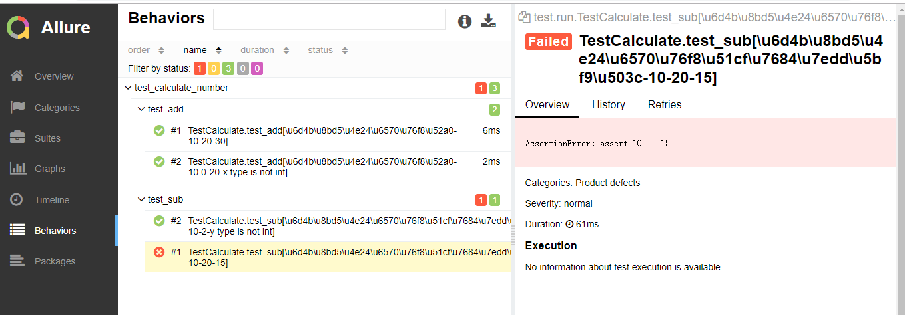

## pytest_allure_demo
用 pytest+allure 做的一个自动化测试demo，可以添加excel文件的case或者python文件的case，
并且生成漂亮的测试报告

### 功能
- 自动化测试demo
- 生成测试报告

### 依赖
    python3.6
    pytest3.6.2
    allure2.6.0
    pytest-allure-adaptor1.7.10

### 运行服务&&生成测试报告
    pytest test/run.py -k=calculate -q -s
    allure serve allure-results
  
### 报告截图

    
    

